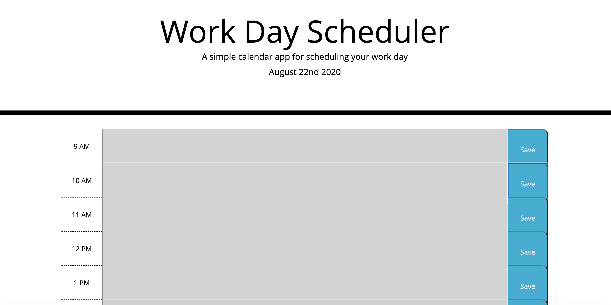

# myscheduler

This scheduler was designed to save the tasks one deems essential on the current day. Specifically, those occurring during the hours of 9 AM and 5 PM. Anything else is off limits. The application designates colors with temporal distinctions: white for past, orange for present, and green for future. This designation should make it easier for the user to assign tasks throughout the day, as well as maximize their time.

[Javascript Fundamentals Quiz](https://cynesthete.github.io/myscheduler/) is hosted on GitHub pages.

This application was authored by [Tony Rivas](https://cynesthete.github.io).

Author's note: advice and mentorship from Bobbi Tarkany was essential in the creation of this application. I would like to humbly thank her for the advice and guidance in coding and debugging this application. She helped me push and articulate what I had learned in order to make this work properly.